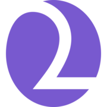

#  "Drink2Go" - Online store of coffee drinks

Diploma project at asynchronous course "Profession "Frontend Developer" by [HTML Academy](https://htmlacademy.ru).

Project completed by [Sergey Troshkin](https://htmlacademy.ru/profile/therealdeveloper)

## Project start and build

* Dependencies installing: `npm i`
* Project build: `npm run build`
* Local server starting: `npm start`

## Project review

https://sergey-et.github.io/drink-to-go/
